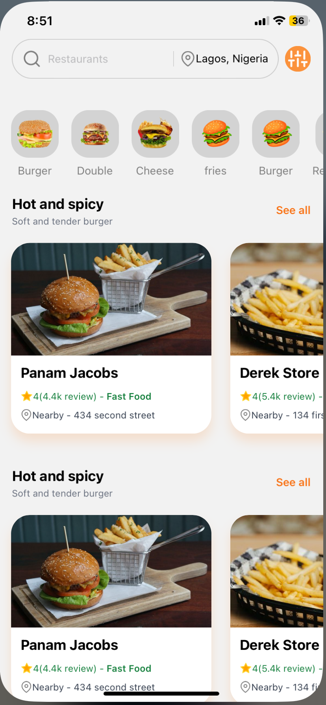
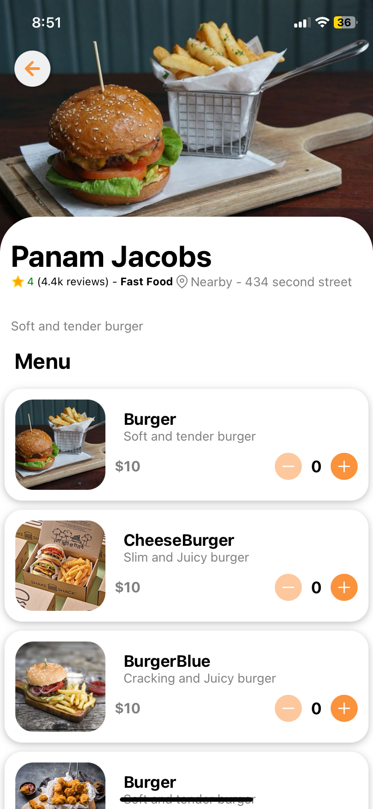
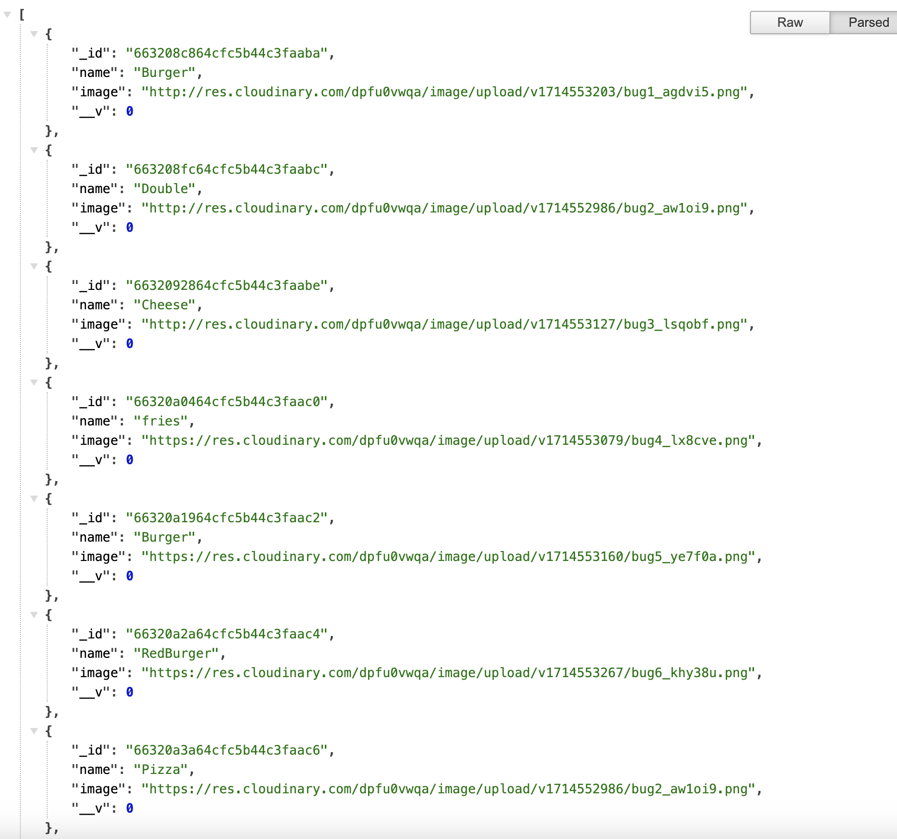
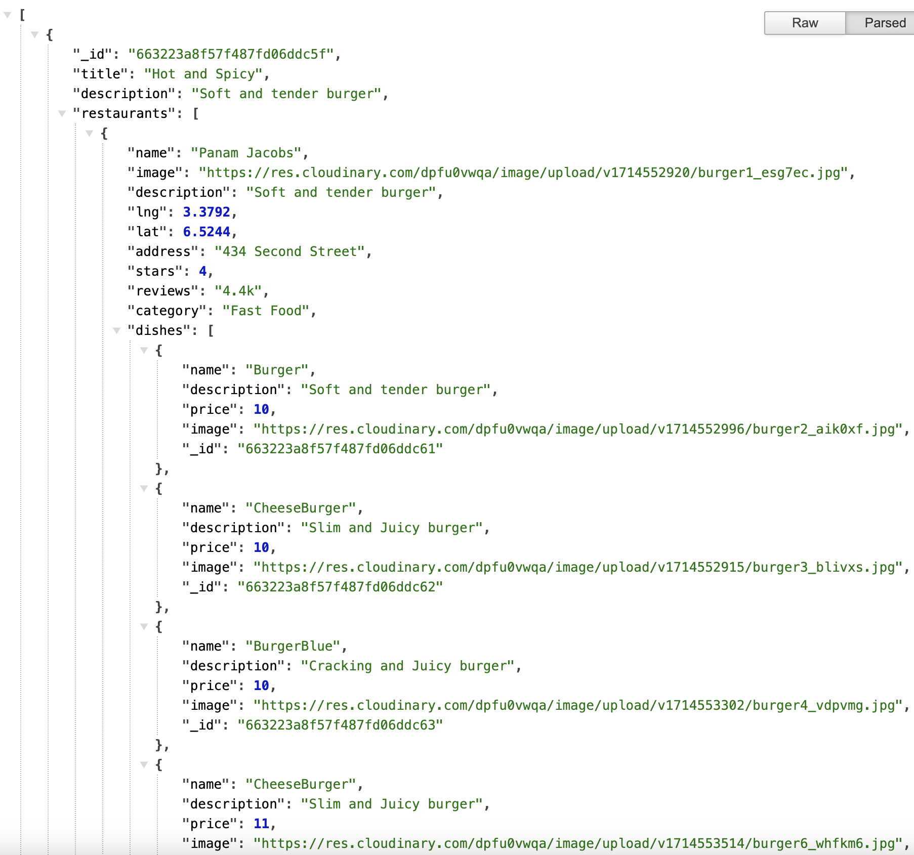

Backend Creation for Burger App

Overview
The backend for the burger app is built using Node.js and Express. It provides RESTful APIs to manage categories and restaurants, supporting the frontend functionalities. Here, I outline the key components and structure of the backend.

API Endpoints
Categories API:

GET: https://burgerapp-backend.onrender.com/categories
POST: https://burgerapp-backend.onrender.com/categories
Restaurants API:

GET: https://burgerapp-backend.onrender.com/restaurants
POST: https://burgerapp-backend.onrender.com/restaurants

Key Components
Express Router

The Express router is used to define API endpoints for categories and restaurants. It ensures a modular and organized structure.

Category Management

Category Model
The Category model defines the schema for categories in the database.

Category Controller
Handles the logic for fetching and creating categories.
getCategories: Fetches all categories.
createCategory: Creates a new category.

javascript
const getCategories = async (req, res) => {
    try {
        const categories = await Category.find();
        res.status(200).json(categories);
    } catch (error) {
        res.status(500).json({ message: 'Error fetching categories', error });
    }
}

const createCategory = async (req, res) => {
    try {
        const category = new Category(req.body);
        await category.save();
        res.status(201).json(category);
    } catch (error) {
        res.status(500).json({ message: 'Error creating category', error });
    }
}

module.exports = { getCategories, createCategory };

Category Routes
Defines the routes for category-related API requests.

javascript
const express = require('express');
const { getCategories, createCategory } = require('../controllers/categoryControllers');
const router = express.Router();

router.get('/', getCategories);
router.post('/', createCategory);

module.exports = router;

Restaurant Management
Restaurant Model
The Restaurant model defines the schema for restaurants in the database.

Restaurant Controller
Handles the logic for fetching and creating restaurants.

getAllRestaurants: Fetches all restaurants.
createNewRestaurant: Creates a new restaurant.

javascript
const getAllRestaurants = async (req, res) => {
    try {
        const restaurants = await Restaurant.find();
        res.status(200).json(restaurants);
    } catch (error) {
        res.status(500).json({ message: 'Error fetching restaurants', error });
    }
}

const createNewRestaurant = async (req, res) => {
    try {
        const restaurant = new Restaurant(req.body);
        await restaurant.save();
        res.status(201).json(restaurant);
    } catch (error) {
        if (error.name === 'ValidationError') {
            res.status(400).json({ message: 'Validation error', errors: error.errors });
        } else {
            res.status(500).json({ message: 'Error creating restaurant', error });
        }
    }
}

module.exports = { getAllRestaurants, createNewRestaurant };

Restaurant Routes
Defines the routes for restaurant-related API requests.

javascript
const express = require('express');
const { getAllRestaurants, createNewRestaurant } = require('../controllers/restaurantControllers');
const router = express.Router();

router.get('/', getAllRestaurants);
router.post('/', createNewRestaurant);

module.exports = router;

Conclusion
The backend for the burger app is designed to be modular and scalable, providing a robust foundation for the frontend application. By using Express and a schema-based approach for data handling, we ensure consistent and reliable API responses. The complete backend code can be found on my GitHub repository.

Resources
Frontend GitHub Repository - https://github.com/qubesmagazine/burger-frontendapp
Backend GitHub Repository -   https://github.com/qubesmagazine/burgerApp-backend

Feel free to explore the code and leave feedback or questions. Happy coding!